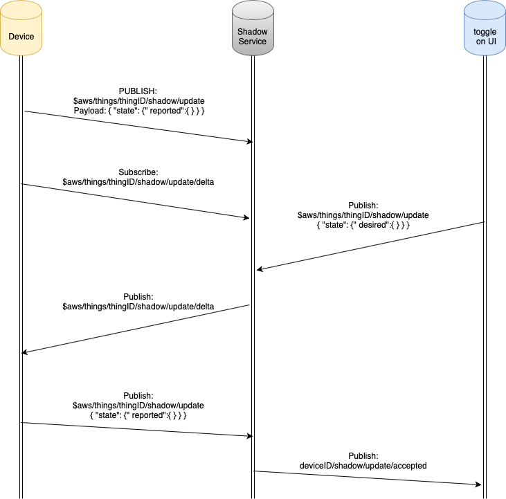

# Getting Started Guide: Out of Box demo for Microchip PIC32MZW1 curiosity board

Devices: | **PIC32MZW1 | WFI32** | **Trust\&Go (ECC608)** |

## Introduction

1.  This document describes the Out of Box (OOB) operation of the PIC32MZW1 curiosity board.

2.  For accessing production hex files, release notes, and Known Issues please click the [release tab](https://github.com/MicrochipTech/PIC32MZW1_Curiosity_OOB/releases)

## Material Required

  - PIC32MZW1 Curiosity board package.

  - Wi-fi Access point or Mobile Hotspot with internet access.

  - Personal Computer.

  - USB-UART converter (optional).

## Hardware setup

<p align="center">

</p>

1.  Make sure that you have the credentials to the Wi-Fi AP with internet access handy.

2.  Make sure that J202 is connected to VBUS-IN.

3.  Connect the USB Cable between ***Target USB*** and your PC.

## LED Indications 

Red User LED onboard is used to indicate connectivity status of the demo. LED indications are

| Redl LED Behavior       |                      Mode                      |
| ----------------------- | ---------------------------------------------- |
| ***ON***                | Not connected to WiFi                          |
| ***Flickering***        | Connecting to cloud                            |
| ***OFF***               | Connected to cloud and the demo is operational |


Green user LED is controlled by the web application and Voice control.

## Operation

1.  Connect curiosity board to the PC

2.  3 Green LEDs representing the power section readiness and the RED user LED representing network connection status will be active when the board is powered up.

3.  The device enumerates as a mass storage device (***MSD***).

4.  Open the file “***clickme.html***” from the MSD on a browser.

5.  Download the credentials configuration file (***WIFI.CFG***) from the landing page and store it in the enumerated MSD.

<p align="center">

</p>

6.  Once the device connects to the cloud, the RED User led will turn off.

7.  Now, the device control page (landing page of “*clickme.html*” will indicate that the device data is available.

<p align="center">

</p>
8.  Temperature sensor data (in Celsius) will be shown in a graph on the page.

9.  Click on the **What's Next** button beneath the graphs to perform action(s) from the cloud.

10. Select the **Implement a Cloud-Controlled Actuator** to control an on-board LED from the cloud.

<p align="center">

</p>

11. Click on the **Learn More** button to expand the card and Scroll to the bottom of the page to **Control Your Device**.

<p align="center">

</p>

12. Select an LED state using the toggle button and click on “**Send to Device**”. This will trigger a cloud message to control the on-board (Green) LED.

<p align="center">

</p>

## Voice Control

*TBD*

## Connecting to your own cloud instance

By default, the demo connects to an instance of AWS IoT maintained by Microchip. The demo lets you move the device connection between your own cloud instance and the Microchip maintained AWS IoT instance without a firmware change. Follow the steps below to get the device connected to your own cloud instance.

1.  Create an AWS account or log in to your existing AWS account.

2.  Navigate to [IoT Core console](https://console.aws.amazon.com/iot/) \> Manage \> Things and click on “***Create***” / “***Register a Thing***”

<p align="center">

</p>

3.  Select “***Create a single thing***”

4.  For thing name, copy and paste the thing name from original demo web-app. This thing name originates from the device certificate and is used by the firmware to send messages to a unique topic.

<p align="center">

</p>

5.  Select defaults for the other fields and click “Next” at the bottom of the page.

6.  Select “***Create thing without certificate***” in the next page.

7.  Go to “***Secure***” \> “***Policies***” and select “***Create a Policy***”

<p align="center">

</p>

8.  Create a new policy which allows all connected devices to perform all actions without restrictions

***Note***: This is not recommended for production.

| Item               | Policy Parameter |
| ------------------ | ---------------- |
| ***Name***         | allowAll         |
| ***Action***       | iot:\*           |
| ***Resource Arn*** | \*               |
| ***Effect***       | Allow            |

<p align="center">

</p>

9.  Navigate to ***Certificates*** \> ***Create a certificate***

<p align="center">

</p>

10. Select Create with “***Get Started***” under “***Use my certificate***”.

11. In the next screen, click “***Next***” without making any selections.

12. Click on “***Select certificates***”

13. In the MSD that is enumerated when the curiosity board is plugged in, you can find a “***.cer***” file with an alphanumeric name. Select this file when prompted to select a certificate.

14. Select “***Activate all***” and click “***Register certificates***”

<p align="center">

</p>

15. Select the certificate and
    
    1.  Click ***Attach policy*** and select the “allowAll” policy we created
    
    2.  Click ***Attach thing*** and select the thing we created

<p align="center">

</p>

16. Navigate to “***Settings***” and copy the endpoint URL

<p align="center">

</p>

17. Navigate to the MSD and open “***cloud.json***”

18. Replace the “***brokerName***” attribute with the endpoint URL.

19. Reboot the device. Now, the device will connect to your own cloud instance.

20. In the AWS IoT console, navigate to “***test***” and subscribe to topic “***+/sensors***”

<p align="center">

</p>

21. You will be able to observe periodic temperature data coming into the console from your device.

22. To control the Green LED, publish the following message:

<table>
<thead>
<tr class="header">
<th><strong>Topic</strong></th>
<th>$aws/things/<em><strong>thingName</strong></em>/shadow/update/delta</th>
</tr>
</thead>
<tbody>
<tr class="odd">
<td><strong>Payload</strong></td>
<td><pre>
{
  "state": {
    "desired": {
      "toggle": 1
    }
  }
}
</pre></td>
</tr>
</tbody>
</table>

Depending on the value of “***toggle***” (0/1) , the Green LED will be ON/OFF.

## Restoring factory configurations

After changing the cloud configurations to connect the device to your own cloud instance, there are two mechanisms to recover the factory default configurations.

1.  Reboot the device while SW1 is engaged.
    
    -  Keep the switch engaged until the Red LED turns on.

2.  Flash the original demo image by downloading if from the [releases](https://github.com/MicrochipTech/PIC32MZW1_Curiosity_OOB/releases) tab.

## Application Overview

The demo code is written as a FreeRTOS based MPLAB Harmony3 application that leverages the system service-based architecture of PIC32MZW1.

The following table shows the main RTOS Tasks and their primary roles in the system.

| Task Name          | Roles                                                                                              |
| ------------------ | -------------------------------------------------------------------------------------------------- |
| ***app\_wifi***    | Maintains Wi-Fi state machine.                                                                     |
| ***msd\_app***     | Maintains MSD device and the drive contents including device certificates and cloud configuration. |
| ***app\_control*** | Maintains synchronized datastore for all tasks.                                                    |
| ***mqtt\_app***    | Maintains MQTT state machine.                                                                      |

The MQTT service internally uses a modified version of the PahoMQTT client to maintain an MQTT connection with AWS IoT Core. The “***mqtt\_app***” task publishes the temperature sensor data every second to AWS IoT Core.

## Cloud Interaction

The application publishes data every second to the cloud endpoint.

 **Topic**:
 
> ***\<thingName\>***/sensors
 
 **payload**:
```json
 {
    "Temperature (C)": temperatureValue 
 }
``` 
<p align="center">

</p>

  - This data is routed to the web application for rendering.

  - For interacting with the device from the cloud (webapp or voice), AWS device shadows are used.

<!-- end list -->

Device subscribes to delta to receive actionable changes

 **Topic**:
> 
> $aws/things/\<***thingName***\>/shadow/update/delta

User Interface (webapp/Voice) publishes payload to Device Shadow

 **Topic:**
> 
> $aws/things/\<***thingName***\>/shadow/update
> 
> **Payload:**
```json 
{
    "state":
    {
        "desired":
        {
            "toggle": toBeUpdatedToggleValue
        }
    }
}
```
Device receives the shadow update, takes required action and update the reported shadow state.

 **Topic**:
> 
> $aws/things/\<***thingName***\>/shadow/update
> 
 **Payload**:

```json 
{
    "state": {
        "reported": {
            "toggle": updatedToggleValue
        }
    }
}
```

The code for all this interaction is in mqtt\_app.c

## Secure Provisioning & Transport Layer Security

The PIC32MZW1 Curiosity boards are shipped with the WFI32 module variants that includes an on-board [Trust\&Go](https://www.microchip.com/design-centers/security-ics/trust-platform/trust-go) secure element. Since [Trust\&Go](https://www.microchip.com/design-centers/security-ics/trust-platform/trust-go) devices are pre-provisioned, the firmware can utilizes the on-chip certificate to securely authenticate with AWS IoT Core.

Server certificate verification is skipped to facilitate the use of the same demo code to easily connect with other cloud instances or custom MQTT brokers. Please refer to Harmony3 documentation to learn more about peer certificate verification.

## Understanding the Device Shadow in AWS

1.  The AWS broker allows for the use of Shadow Topics. The Shadow Topics are used to retain a specific value within the Broker, so End-Device status updates can be managed.

<!-- end list -->

    - Shadow Topics are used to restore the state of variables, or applications.

    - Shadow Topics retain expected values, and report if Published data reflects a difference in value.

    - When difference exist, status of the delta is reported to those subscribed to appropriate topic messages.

<p align="center">

</p>

2.  Updates to the device shadow are published on $aws/things/\<***ThingName***\>/shadow/update topic. When a message is sent to the board by changing the value of the **toggle** fields in **Control Your Device** section:

<!-- end list -->

    - This message is published on the $aws/things/\<***ThingName***\>/shadow/update topic.

    - If the current value of toggle in the device shadow is different from the toggle value present in the AWS Device Shadow, the AWS Shadow service reports this change to the device by publishing a message on $aws/things/\<***ThingName***\>/shadow/update/delta topic.

    - The JSON structure of the message sent should be as below

```json
{
    "state": {
        "desired": {
            "toggle": value 
        }
    }
}
```

3.  AWS IoT Core publishes a delta topic message if there is a difference between the reported and desired states. The device would have already subscribed to the delta topic.

4.  This message is published on the $aws/things/\<***ThingName***\>/shadow/update topic.

<!-- end list -->

    - If the current value of toggle in the device shadow is different from the toggle value present in the AWS Device Shadow, the AWS Shadow service reports this change to the device by publishing a message on $aws/things/\<***ThingName***\>/shadow/update/delta topic.

    - The JSON structure of the message sent should appear as below

```json
{
    "state": {
        "desired": {
            "toggle": value
        }
    }
}
```

5.  Application flow when using the device shadow

<p align="center">

</p>

## Debugging

To see debug logs and to interact with the demo using a command line interface, connect a USB-UART converter to the UART1 pins in the GPIO header of the curiosity board an dopen a UART terminal in the PC with settings ***115200 8N1***. Issue the ***help*** command to see a list of available commands. 
