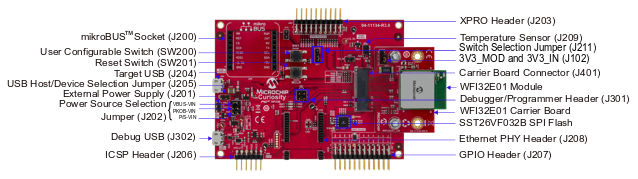
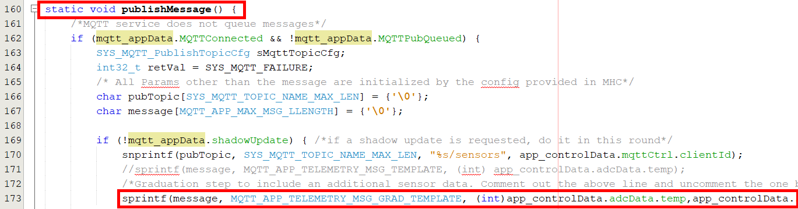
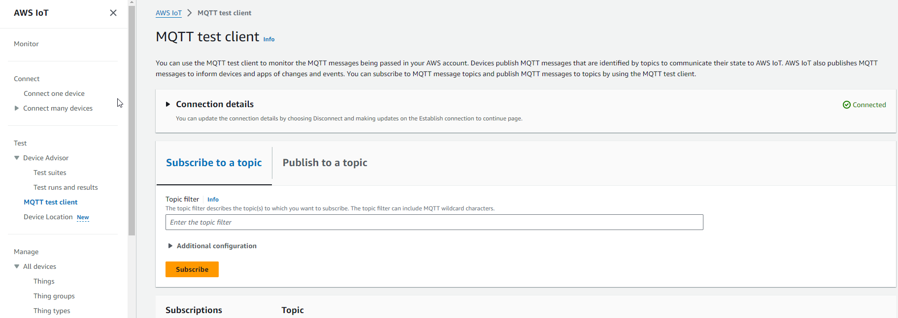

# Getting Started Guide: Secure Cloud Connectivity and Voice Control Demo for Microchip PIC32 WFI32E Curiosity Board .

Devices: **| PIC32 WFI32E | WFI32 | Trust\&Go (ECC608) |**

Features: **| Secure Cloud connectivity | Voice Control |**

[**Frequently Asked Questions**](https://github.com/MicrochipTech/PIC32MZW1_Curiosity_OOB/blob/master/faq.md)

[](https://github.com/MicrochipTech/PIC32MZW1_Curiosity_OOB/releases/latest)
[](https://github.com/MicrochipTech/PIC32MZW1_Curiosity_OOB/releases/latest)


## Introduction

1.  This page describes the Out of Box (OOB) operation of the PIC32 WFI32E Curiosity board .

2.  For accessing pre-built hex files, release notes, and known issues, please click the [**Releases** tab](https://github.com/MicrochipTech/PIC32MZW1_Curiosity_OOB/releases).

## Prerequisites

- PIC32 WFI32E Curiosity Board kit

- Wi-Fi Access Point or mobile hotspot with Internet access

- Personal Computer

- USB-UART converter (optional)

## Hardware Setup

<p align="center">

</p>

1.  Ensure that the credentials to the Wi-Fi AP with Internet access are handy

2.  Ensure that J202 jumper is connected to VBUS-VIN

3.  Connect host PC to the **_USB Power connector (J204)_** using a USB Type-A male to micro-B USB cable.

## LED Indications

The on-board red user LED (D202) indicates the connectivity status of the demo.

| Red LED Behavior | Mode                                           |
| ----------------- | ---------------------------------------------- |
| **_ON_**          | Not connected to Wi-Fi                         |
| **_Fast Blinking_**    | Connecting to cloud                            |
| **_OFF_**         | Connected to cloud and the demo is operational |
|**_Slow Blinking_**| Image issue. Re-flash the demo image to recover |

The web application and voice assistant control the green user LED (D204).

## Mode of Operation

The demo has a web app and voice-based interaction model. In the web-app based interaction mode, you can visualize the data telemetry from the PIC32 WFI32E Curiosity Board and interact with the the board using a web-browser based application. In the voice-based interaction mode, you can control the on-board user LED with voice commands using Amazon Alexa®.

  > :boom:  &nbsp; While editing `cloud.json` or `WIFI.CFG` manually use ***notepad.exe*** . Other editors like Notepad++ can damage the underlying FAT12 FS. You can read more about this generic issue in the discussion [here](https://github.com/adafruit/circuitpython/issues/111) . In case you come across this, please re-flash the image to recover.

### Web-App Mode

Perform the following steps:

1.  Connect the Curiosity Board to your PC

2.  3 Green LEDs representing the power section readiness and the red user LED representing network connection status will be active when the board is powered up.

3.  The device enumerates as a mass storage device (**_MSD_**).

4.  Open the ***"_clickme.html_"*** file from the MSD on a browser.

  > :information_source:  &nbsp; It is recommended to use the latest version of a modern browser for this operation.

5.  Download the credentials configuration file (**_WIFI.CFG_**) from the landing page and copy it into the enumerated MSD.
 
  > :boom:  &nbsp; Do not store the file directly on the enumerated MSD. Make sure that you download the file to your computer and then copy the file into the MSD. Please make sure the file is named **_WIFI.CFG_** while copying it to the MSD drive.

  > :boom:  &nbsp; The on-chip filesystem is configured as FAT16. Browsers like Google Chrome do not handle direct download into FAT16 well. In case you face issues with directly saving the configuration file into the MSD, store the file into your PC first and manually copy the file into the drive to replace the default **_WIFI.CFG_** file.

<p align="center">

</p>

6. Once the credentials file is copied to the MSD, reset the device to start using the new credentials. Ensure that the copy process has completed before you reset the device.

6.  Upon reboot, the device connects to the Wi-Fi followed by the cloud, and the red user LED will turn OFF.

7.  The device control page (landing page of “_clickme.html_” will indicate that the device data is now available by showing a (tick) mark above the state corresponding to the device connection stage.

<p align="center">

</p>

8.  Temperature sensor data (in Celsius) will be shown in a graph on the page.

9.  Click on the ***"What's Next"*** button beneath the graphs to perform action(s) from the cloud.

10. Select the ***"Implement a Cloud-Controlled Actuator"*** to control an on-board LED from the cloud.

<p align="center">

</p>

11. Click on the ***"Learn More"*** button to expand the card and Scroll to the bottom of the page to ***"Control Your Device"***.

<p align="center">

</p>

12. Select an LED state using the ***toggle*** button and click on ***"Send to Device"***. This will trigger a cloud message to control the on-board (Green) LED.

<p align="center">

</p>

13. To navigate directly to the Web-App, use a link in the format https://pic-iot.com/pic32mzw1/aws/ <**_ThingName_**>.
  
### Voice Control Mode

1. Create an account and log-in to the [device registration page](https://microchiptech.github.io/mchpiotvoice/).

  >  :information_source: &nbsp; ***"Supported browsers:"*** Google Chrome, Mozilla Firefox, Safari, and Microsoft Edge. We recommend downloading the newest browser version for the best experience. *Internet Explorer is not supported*
  
  > You can reach this page by clicking on ***voice.html*** in the MSD

2. Enter your thing name and a friendly name and _claim_ your device by registering it.

  > Thing ID is at the top of the page just above the temperature graph

    - Successfully claimed devices will show up in the device listing in the left side panel.

  >  :information_source: &nbsp; Only devices registered to the Microchip Cloud account can be registered for voice control and controlled via the voice skills. In case of registration errors, please contact [Microchip support](http://microchip.com/support)

3. Using the Amazon Alexa® app, enable the skill ***" [Microchip IoT](https://www.amazon.com/gp/product/B08B5THZH5?ref&ref=cm_sw_em_r_as_dp_iuhtblwcTlYL4)"*** and add the dev board as a smart home device.

  > to navigate to the Amazon skill enablement page, click on **[Microchip IoT](https://www.amazon.com/gp/product/B08B5THZH5?ref&ref=cm_sw_em_r_as_dp_iuhtblwcTlYL4)**
  
  > Find out more information about connecting smart home devices at Connect a Smart Home Device to Alexa from [this link](http://tinyurl.com/alexa-smart-home)
  
4. You can now control the on-board user LED with voice commands using the ***"friendly name"*** provided while claiming the device in step 1.

   E.g: _Alexa, turn on the light_


## Adding Another Sensor

The front-end supports visualization of up to three pieces of sensor data. Since the Curiosity Board contains Just the temperature sensor by default, we will use the user Switch (`SW1`) to simulate another sensor. Perform the sollowing steps to start visualizing the switch position in the web application.

1.  Download the latest version of the firmware from the [releases](https://github.com/MicrochipTech/PIC32MZW1_Curiosity_OOB/releases) tab.

2.  Open the project in MPLABX.
    
      - Use [MPLABX](https://www.microchip.com/mplab/mplab-x-ide?gclid=Cj0KCQjw_ez2BRCyARIsAJfg-ksTefWxHYsG43Succ4obrD2ecwpP99wMUHjUCuoBdvmveCIB8JgoMIaAiCdEALw_wcB) version `5.40` or above and [XC32](https://www.microchip.com/mplab/compilers) version `2.41` or above.

3.  In ***“mqtt\_app.c"*** file comment out the existing telemetry message line and uncomment the graduation step.

<p align="center">

<p/>

4.  Recompile the application and download it into the target.
    - You can access the firmware source code under the `src/firmware` folder of this repo
    - To compile the project, open the firmware using [MPLAB X IDE](https://www.microchip.com/mplab/mplab-x-ide) version `5.40` or higher and use [XC32](https://www.microchip.com/mplab/compilers) compiler version `2.41` or higher

5.  Follow the steps given under ***“Mode of Operation”***.

6.  Press `SW1` to see the web application graph reflecting the change.

## Connecting to Your Cloud Instance

By default, the demo connects to an instance of AWS IoT maintained by Microchip. The demo lets you move the device connection between your cloud instance, and the Microchip maintained AWS IoT instance without a firmware change. Perform the following steps to get the device connected to your own cloud instance.

1.  Create an AWS account or log in to your existing AWS account.
    - Please refer to [Set up your AWS account](https://docs.aws.amazon.com/iot/latest/developerguide/setting-up.html) and [Create AWS IoT resources](https://docs.aws.amazon.com/iot/latest/developerguide/create-iot-resources.html) for details.

2.  Navigate to [IoT Core console](https://console.aws.amazon.com/iot/) \> Manage \> Things and click on “**_Create_**” / “**_Register a Thing_**”

<p align="center">

</p>

3.  Select “**_Create a single thing_**”

4.  For thing name, copy and paste the thing name from the original demo web-app. This thing name originates from the device certificate and is used by the firmware to send messages to a unique topic.

<p align="center">

</p>

5.  Select defaults for the other fields and click “Next” at the bottom of the page.

6.  Select “**_Create thing without certificate_**” in the next page.

7.  Go to “**_Secure_**” \> “**_Policies_**” and select “**_Create a Policy_**”

<p align="center">

</p>

8.  Create a new policy which allows all connected devices to perform all actions without restrictions

  > :x: &nbsp; **_Note_**: This policy grants unrestricted access for all iot operations, and is to be used only in a development environment. For non-dev environments, all devices in your fleet must have credentials with privileges that authorize intended actions only, which include (but not limited to) AWS IoT MQTT actions such as publishing messages or subscribing to topics with specific scope and context. The specific permission policies can vary for your use cases. Identify the permission policies that best meet your business and security requirements.Please refer to [sample policies](https://docs.aws.amazon.com/iot/latest/developerguide/example-iot-policies.html) and [security best practices](https://docs.aws.amazon.com/iot/latest/developerguide/security-best-practices.html)

| Item               | Policy Parameter |
| ------------------ | ---------------- |
| **_Name_**         | allowAll         |
| **_Action_**       | iot:\*           |
| **_Resource Arn_** | \*               |
| **_Effect_**       | Allow            |

<p align="center">

</p>

9.  Navigate to **_Certificates_** \> **_Create a certificate_**

<p align="center">

</p>

10. Select Create with “**_Get Started_**” under “**_Use my certificate_**”.

11. In the next screen, click “**_Next_**” without making any selections.

12. Click on “**_Select certificates_**”

13. In the MSD enumerated when the Curiosity Board is plugged in, you can find a “**_.cer_**” file with an alphanumeric name. Select this file when prompted to select a certificate.

14. Select “**_Activate all_**” and click “**_Register certificates_**”

<p align="center">

</p>

15. Select the certificate and

    1.  Click **_Attach policy_** and select the “allowAll” policy we created

    2.  Click **_Attach thing_** and choose the *thing* we created

<p align="center">

</p>

16. Navigate to “**_Settings_**” and copy the endpoint URL

<p align="center">

</p>

17. Navigate to the MSD and open “**_cloud.json_**”

  > :boom: &nbsp; While editing `cloud.json` or `WIFI.CFG` manually use ***notepad.exe*** . Other editors like Notepad++ can damage the underlying FAT12 FS. You can read more about this generic issue in the discussion [here](https://github.com/adafruit/circuitpython/issues/111). In case you come across this, please re-flash the image to recover.

18. Replace the “**_brokerName_**” attribute with the endpoint URL.

19. Reset the device. Now, the device will connect to your own cloud instance.

20. In the AWS IoT console, navigate to “**_test_**” and subscribe to topic “**_+/sensors_**”

<p align="center">

</p>

21. You will be able to observe periodic temperature data coming into the console from your device.

22. To control the Green LED, publish the following message:

<table>
<thead>
<tr class="header">
<th><strong>Topic</strong></th>
<td>$aws/things/<em><strong>thingName</strong></em>/shadow/update</td>
</tr>
</thead>
<tbody>
<tr class="odd">
<td><strong>Payload</strong></td>
<td><pre>
{
  "state": {
    "desired": {
      "toggle":1
    }
  }
}
</pre></td>
</tr>
</tbody>
</table>

Depending on the value of “**_toggle_**” (1/0) , the Green LED will be ON/OFF.

## Restoring factory cloud configurations

After changing the cloud configurations to connect the device to your cloud instance, there are two mechanisms to recover the factory default configurations.

  > :information_source: &nbsp; This step will just restore the cloud and Wi-Fi configurations to factory settings. The image is not altered.

1.  Reboot the device while SW1 is engaged.

    - Keep the switch engaged until the Red LED turns on.

2.  Flash the original demo image by downloading it from the [releases](https://github.com/MicrochipTech/PIC32MZW1_Curiosity_OOB/releases) tab.

## Application Overview

The demo code is written as a FreeRTOS based MPLAB Harmony3 application that leverages the system service-based architecture of PIC32MZ W1.

The following table shows the main RTOS Tasks and their primary roles in the system.

| Task Name         | Roles                                                                                              |
| ----------------- | -------------------------------------------------------------------------------------------------- |
| **_app_wifi_**    | Maintains Wi-Fi state machine.                                                                     |
| **_msd_app_**     | Maintains MSD device and the drive contents including device certificates and cloud configuration. |
| **_app_control_** | Maintains synchronized datastore for all tasks.                                                    |
| **_mqtt_app_**    | Maintains MQTT state machine.                                                                      |

The MQTT service internally uses a modified version of the PahoMQTT client to maintain an MQTT connection with AWS IoT Core. The “**_mqtt_app_**” task publishes the temperature sensor data every second to AWS IoT Core.

## Cloud Interaction

The application publishes data every second to the cloud endpoint.

**Topic**:

> **_\<thingName\>_**/sensors

**payload**:

```json
{
  "Temperature (C)": temperatureValue
}
```

<p align="center">

</p>

- This data is routed to the web application for rendering.

- For interacting with the device from the cloud (webapp or voice), AWS device shadows are used.

<!-- end list -->

Device subscribes to delta to receive actionable changes

**Topic**:

> \$aws/things/\<**_thingName_**\>/shadow/update/delta

User Interface (webapp/Voice) publishes payload to Device Shadow

**Topic:**

> \$aws/things/\<**_thingName_**\>/shadow/update
>
**Payload:**

```json
{
  "state": {
    "desired": {
      "toggle": toBeUpdatedToggleValue
    }
  }
}
```

Device receives the shadow update, takes necessary action, and updates the reported shadow state.

**Topic**:

> \$aws/things/\<**_thingName_**\>/shadow/update
>
> **Payload**:

```json
{
  "state": {
    "reported": {
      "toggle": updatedToggleValue
    }
  }
}
```

The code for all this interaction is in mqtt_app.c

## Secure Provisioning & Transport Layer Security

The PIC32 WFI32E Curiosity Boards kits are shipped with the WFI32 module variants that include an on-board [Trust\&Go](https://www.microchip.com/design-centers/security-ics/trust-platform/trust-go) secure element. Since [Trust\&Go](https://www.microchip.com/design-centers/security-ics/trust-platform/trust-go) devices are pre-provisioned, the firmware can utilise the on-chip certificate to securely authenticate with AWS IoT Core.

Server certificate verification is skipped to facilitate using the same demo code to connect with other cloud instances or custom MQTT brokers easily. Please refer to (Harmony3 documentation)[https://microchip-mplab-harmony.github.io/net] to learn more about peer certificate verification.

## Understanding the Device Shadow in AWS

1.  The AWS broker allows for the use of Shadow Topics. The Shadow Topics are used to retain a specific value within the Broker so that End-Device status updates can be managed.

    - Shadow Topics are used to restore the state of variables or applications.

    - Shadow Topics retain expected values and report if Published data reflects a difference in value.

    - When difference exist the status of the delta is reported to those subscribed to appropriate topic messages.

<!--p align="center">

</p-->

2.  Updates to the device shadow are published on \$aws/things/\<**_ThingName_**\>/shadow/update topic. When a message is sent to the board by changing the value of the **toggle** fields in **Control Your Device** section:

    - This message is published on the $aws/things/\<***ThingName***\>/shadow/update topic.

    - If the current value of toggle in the device shadow is different from the toggle value present in the AWS Device Shadow, the AWS Shadow service reports this change to the device by publishing a message on $aws/things/\<***ThingName***\>/shadow/update/delta topic.

    - The JSON structure of the message sent should be as below

        ```json
        {
        "state": {
            "desired": {
            "toggle": value
            }
        },
        "version" : 10
        }
        ```

3.  AWS IoT Core publishes a delta topic message if there is a difference between the reported and desired states. The device would have already subscribed to the delta topic.


4.  You can read more about AWS device shadows (here.)[https://docs.aws.amazon.com/iot/latest/developerguide/device-shadow-data-flow.html]

## Re-Flashing the device

In case you want to re-flash the device, perform the following steps:

1.	Download and install (MPLABX Integrated Programming Environment)[https://www.microchip.com/mplab/mplab-integrated-programming-environment]
2.	Connect the power source selection jumper (J202) shunt in ‘PKOB-VIN’ position
3.	Connect the Curiosity Board’s debug USB (J302) to your PC.
4.	Open MPLABX IPE and select ‘PIC32MZ1025W104132’ device and ‘PKOB’ tool.
5.	Download the latest FW image (hex file) from the (releases)[ https://github.com/MicrochipTech/PIC32MZW1_Curiosity_OOB/releases/latest] tab and load it into the IPE ‘hex file’ section.
6.	Click on the ‘connect’ and then the ‘program‘ buttons in the IPE and wait for device programming to complete.

## Regenerating the demo with Harmony 3

To add additional features to the OOB demo, you might have to regenerate the demo code using Harmony3 after adding additional components or changing the existing configuration.
Ensure that you use the same version or Harmony components used in the original demo codebase while regenerating code. You can see the version dependencies of the demo in “harmony-manifest-success.yml” file found at src\firmware\src\config\pic32mz_w1_curiosity into Harmony3 content manager. 

While generating code, make sure that you use “USER_RECENT” merge strategy.

<p align="center">

</p>

The default demo code includes some changes to the generated “net_pres_enc_glue.c” file. Make sure that you retain the changes shown in the images below during code generation. These changes are to enable support for ECC608 TNGTLS in the TLS flow. If the right dependencies are loaded, there should not be any additional merges while regenerating code without any configuration change.

<p align="center">


</p>


## Debugging

To monitor debug logs and to interact with the demo using a command-line interface, connect a USB-UART converter to the UART1 pins in the GPIO header of the Curiosity Board and open a UART terminal in the PC with settings **_115200 8N1_**. Issue the **_help_** command to see a list of available commands.

> UART Tx and Rx pins are marked in the GPIO Header (J207) silkscreen 

This console also prints any error messages if something goes wrong in the FW.

WiFi MAC level logs are printed via UART2. UART2 TX and RX can be easily tapped into a USB-UART converter from the mikroBUS<sup>TM</sup> Socket (J200). (settings: **_115200 8N1_**)
